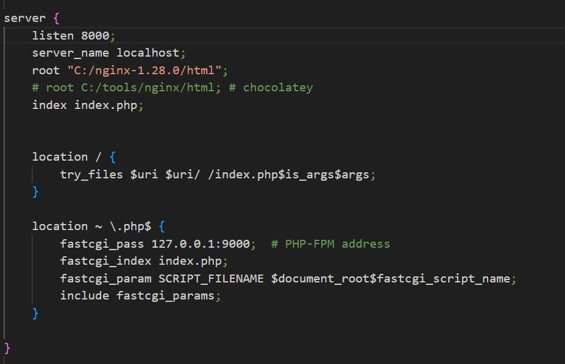
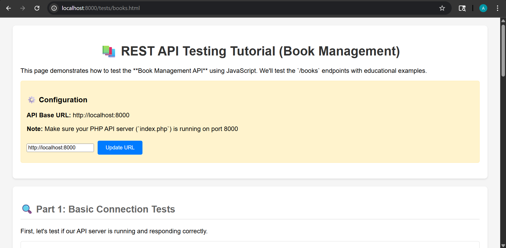

# Nginx Setup
Aaron Milner

--- 

## Step 1
You need to make sure that Nginx is downloaded on your device. It will be easiest it you download it to your main drive (for me this was C:). If you download to somewhere else, make sure you can access the file path.

---

## Step 2
Setting up your nginx.conf 

Make sure the server section looks the same as the image on the next page.

---

---

## Step 2 Cont.
It's important that your programs are listening to the same port as you list in Nginx. 

Save the file once you are done updating. 

---

## Step 3
Refresh Nginx
If you already had the program running as I did there's an easy way to refresh without having to completely restart the program. 

In command line:
>cd "C:\nginx-1.28.0\"
>.\nginx.exe -t

If you get an OK then:
>.\nginx.exe -s reload

---

## Step 4
Go to the url:
>http://localhost:8000/

Depending on your file set up you may have to go a url like:
>http://localhost:8000/tests/books.html

---

---

## Tips and Tricks
If your MySQL is not connecting, go into PHP and make a php.ino from cloning the devlopment ino. From here, delete the semi-colons tha are commenting out the MySQL connections.
Also make sure you have your file paths correct.

---

# Congrats You've Set Up Nginx!

